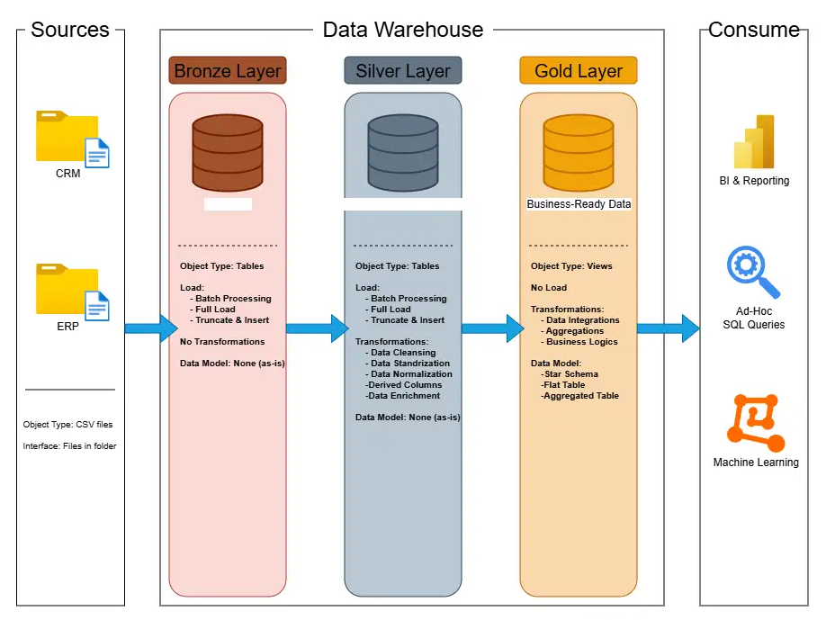

# 📊 Data Warehouse Project – End-to-End Data Engineering

## 🚀 Overview
This project demonstrates the design and implementation of a **modern data warehouse** using industry best practices in data engineering. It covers the full lifecycle from raw data ingestion to analytics-ready data modeling.

The goal was to build a **scalable, maintainable, and production-grade data pipeline** that supports business intelligence and reporting.

---

## 🧱 Architecture
✔ Modular pipeline design  
✔ Separation of staging and production layers  
✔ Idempotent data loads  
✔ Version-controlled transformations  
✔ Scalable architecture  
✔ Clear data lineage  
✔ Documentation-first approach  

---

## 📈 Objective
Develop SQL-based Analytics to deliver detailed insights into:

- **Customer Behavior**
- **Product Performance**
- **Sales Trends**

These insights equip stakeholders with actionable business metrics, empowering informed, data-driven strategic decision-making.

## 📜 License

This project is licensed under the MIT License. You are free to use, modify, and share this project with proper attribution.

## 👤 Author

Hello, I am Andrew Morgado! I'm a data science undergraduate focused on becoming a data analyst, with strong experience in Python for data manipulation, analysis, and automation. I enjoy uncovering trends, building data-driven solutions, and translating complex data into clear business insights.
